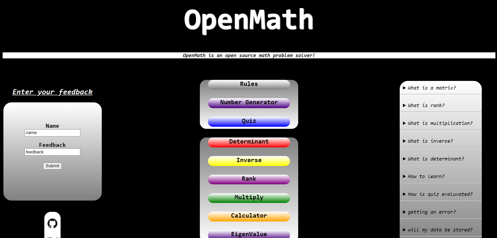
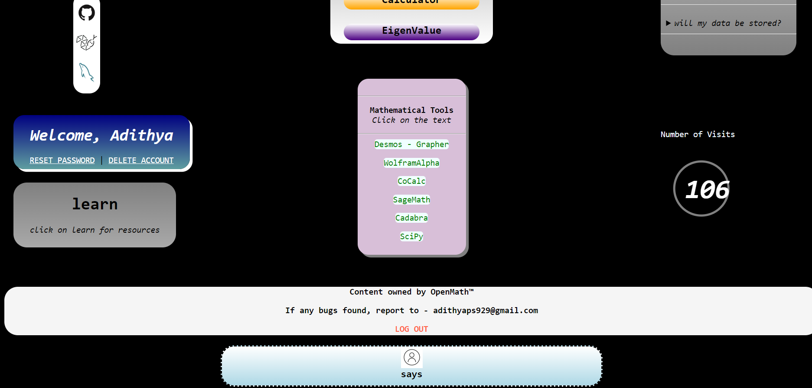
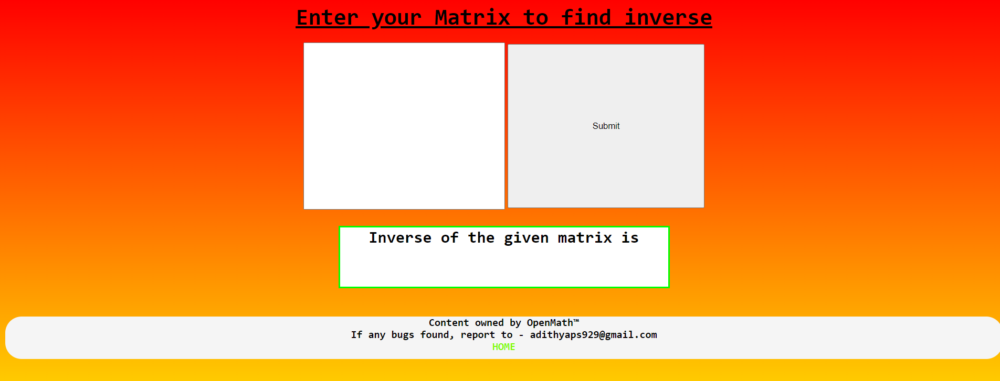

# OpenMath

OpenMath is a webapp which primarily does math calculations especially matrix manipulations.
Built on python, mysql and html+css

# How To Run

<ul>
  <li>Open git and clone the project</li>
  <li>Run the project.py file</li>
  <li>Click on the IP+port address</li>
</ul>

# SnapShots

